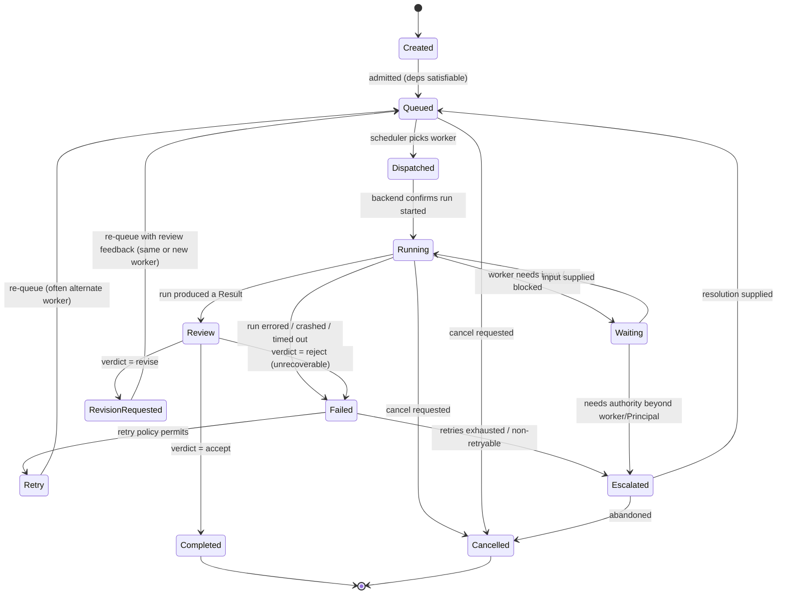
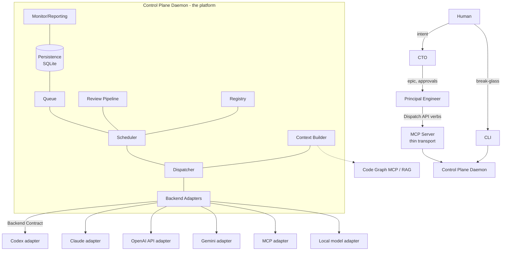

# Loom — Orchestration Platform Architecture

**Audience:** the CTO
**Status:** Proposed (pre-implementation)
**Author:** the Principal Engineer
**Companion documents:** [`IMPLEMENTATION-PLAN.md`](./IMPLEMENTATION-PLAN.md) (how it gets built), [`../plugin/skills/orchestrate/SKILL.md`](../plugin/skills/orchestrate/SKILL.md) (how the Principal operates it), [`CTO-HANDOFF.md`](./CTO-HANDOFF.md) (what needs your sign-off)

> This document defines the platform. It does not define any particular worker, model, or CLI. Those are configuration and adapters. If a sentence in this document would have to change when OpenAI ships a better model or Google ships a new CLI, it is a bug in this document.

---

## 1. Executive Summary

Loom is an orchestration platform for AI-assisted software engineering. It sits *after* discovery — epic, PRD, ADRs, specs, and acceptance criteria already exist — and its single job is **disciplined execution**: turning a queue of well-specified engineering tasks into reviewed, merged work by dispatching them to a pool of interchangeable AI workers.

The platform's defining constraint is **backend independence**. It ships with **two co-first-class reference backends — the Codex CLI and Claude subagents** — deliberately chosen because they are *dissimilar* (an external CLI driven over a process/JSON-RPC boundary vs. in-process Claude subagents spawned by the operator itself). If one narrow contract fits both, the contract is genuinely provider-neutral rather than accidentally Codex-shaped. Neither is an assumption; both are adapters. Higher-level orchestration — the Principal Engineer planning and delegating work — speaks only in engineering concepts: *dispatch this task to the best available worker, review it, retry it elsewhere if it fails*. It never speaks `codex`, `claude`, or `gemini`. When a better coding model appears, replacing the execution technology requires **an adapter and a registry entry** — zero changes to the orchestration layer, the scheduler, or the operator skill.

Loom is best understood as a small operating system for engineering labor: stable syscalls (the Dispatch API), a process table (the task/run store), a scheduler (capability-based worker selection), device drivers (backend adapters), and durable state that survives restarts. The Principal is the shell; workers are the processes; backends are the drivers.

---

## 2. Goals

1. **Backend independence.** Orchestration logic depends on a stable interface, never on a provider's CLI or API shape.
2. **Replaceability.** Adding or swapping an execution backend is an adapter + registry change. The scheduler, dispatch API, and operator skill are untouched.
3. **Capability-based scheduling.** Workers are chosen by fit (coding strength, reasoning, review independence, cost, latency, repo familiarity, availability), never hardcoded.
4. **Durability.** All task, run, result, and metric state persists. The platform survives restarts and does not depend on a Claude conversation staying alive.
5. **Independent review.** Implementation and review are separable and, by default, performed by different workers.
6. **Observability.** Queue depth, worker utilization, task duration, cost, success/failure/retry rates, and backend health are queryable at all times.
7. **Safe parallelism.** Multiple workers run concurrently without merge conflicts, duplicated work, or ownership ambiguity.
8. **Operability by an agent.** The primary operator is a Principal instance following a skill. The interface must be legible to a model, not just a human.

## 3. Non-Goals

- **Not a discovery or planning tool.** Epics, PRDs, ADRs, and specs are inputs. Loom does not author them. (A separate spec/discovery workflow does.)
- **Not a model.** Loom orchestrates models; it contains no model of its own.
- **Not a CI/CD system.** It produces reviewed branches/PRs; existing CI (your merge queue) remains the gate to production.
- **Not a general workflow engine.** It orchestrates engineering tasks with a fixed lifecycle, not arbitrary DAGs of business logic.
- **Not multi-tenant SaaS (initially).** A single team, single operator-at-a-time, self-hosted. The data model does not preclude multi-tenancy later, but it is not designed for it now.
- **Not autonomous of humans.** The CTO owns intent; a human owns merge-to-production. Loom escalates rather than deciding beyond its authority.

---

## 4. Design Philosophy

**Stable concepts, hidden mechanisms.** The platform exposes a small vocabulary that will outlive any provider. Everything provider-specific lives behind an adapter boundary and never leaks upward. The test for every public interface: *would this survive replacing Codex with a 2028 model from a company that does not yet exist?* If not, it is on the wrong side of the boundary.

**Optimize for replacement, not for the first backend.** It is tempting to model the platform on Codex because Codex is what we have. That is the trap. We model the platform on the *abstract shape of delegated engineering work* — a task, a worker, a run, a result, a review — and force Codex to fit through it. Where Codex offers something the abstraction doesn't need (e.g. its internal subagent fan-out), we ignore it. Where Codex lacks something the abstraction requires (a job queue, timeouts, worktree isolation), the platform supplies it. See §16 for exactly which gaps we fill.

**Capabilities over identities.** No orchestration decision names a worker. "Use Sol for hard problems" is a *policy expressed in the registry* (Sol has high reasoning strength), not a line of code. Changing the policy is data, not a deploy.

**Durable by default.** Every state transition is written before it is acted on. The conversation context of the operating agent is treated as *cache*, never as the source of truth. If the Principal's context is lost, a fresh Principal reads the state store and continues.

**Legible to an agent.** The operator is a language model. Interfaces return structured, self-describing data; errors are actionable; the vocabulary matches how a Principal Engineer thinks. A design that is elegant to a human but ambiguous to a model has failed its primary user.

**Small surface, deep implementation.** Few public verbs (§10), each doing a well-defined thing. Complexity lives inside components, not in the interface count.

---

## 5. Core Concepts (Canonical Glossary)

This vocabulary is authoritative. The implementation plan and the operator skill use these terms with exactly these meanings. Drift here is drift everywhere.

| Term | Definition |
|---|---|
| **Loom** | The orchestration platform itself. |
| **CTO** | The CTO role. Owns *intent*: what work matters and why. Approves architecture, resolves business-impacting tradeoffs. Human-adjacent authority. |
| **Principal** | The orchestrator role. Owns *execution*: decomposing an epic into tasks, scheduling, delegating, reviewing, and reporting. Operates Loom through the Dispatch API. |
| **Worker** | A configured execution identity: a (provider, backend, model, capability-profile, constraints) tuple with a stable `worker_id`. Workers are registry entries, not code. Multiple workers can share a backend (e.g. `codex` backend, different models). |
| **Backend** | An adapter implementing the Backend Contract (§9) for one execution mechanism (Codex CLI, Claude subagent, OpenAI API, Gemini CLI, MCP, local model). Backends are the *only* code that knows provider specifics. |
| **Task** | A unit of delegated engineering work with acceptance criteria and a lifecycle (§8). The durable, addressable object. A task outlives the run(s) that attempt it. |
| **Run** | A single execution attempt of a Task by a Worker on a Backend. A Task may have many Runs (retries, alternate workers, revisions). Runs are immutable once terminal. |
| **Dispatch** | The act of the Scheduler + Dispatcher turning a queued Task into a running Run on a chosen Worker. |
| **Context Package** | The curated, minimal set of inputs handed to a worker for a run: relevant files, symbols, specs, ADRs, acceptance criteria, prior review feedback. Built by the Context Builder; never "the whole repo." |
| **Result** | The structured output of a Run: final message, touched files, diff/branch reference, command log, self-reported status, and any schema-constrained deliverable. |
| **Review** (noun) | An independent evaluation of a Run's Result against acceptance criteria, producing an accept / revise / reject verdict with findings. Performed by a different worker than the implementer by default. Distinct from the task **state** `Review` below, which means "a Result exists and is *awaiting* its verdict" — the evaluation has not happened yet. When ambiguous, the state is written `Review (awaiting verdict)`. |
| **Registry** | The declarative catalog of Workers and their capability profiles. |
| **Scheduler** | The component that selects a Worker for a Task by capability-fit scoring (§12). Pluggable policy. |
| **Queue** | The ordered set of Tasks awaiting dispatch, with priority and dependency ordering. |
| **Dispatch API** | The stable set of verbs (§10) through which the Principal operates the platform. The "syscall layer." |
| **Control Plane** | The long-lived process (daemon) that owns the queue, scheduler, persistence, and adapters, and exposes the Dispatch API. |
| **Isolation Unit** | The workspace a Run executes in — typically a git worktree on a dedicated branch — that prevents concurrent runs from colliding. |

---

## 6. Organizational Model

```
Human
  │  owns the business; owns merge-to-production
  ▼
CTO
  │  owns intent: epic prioritization, architecture approval,
  │  business-impacting tradeoffs, escalation resolution
  ▼
Principal Engineer
  │  owns execution: decomposition, scheduling, delegation,
  │  review orchestration, integration, reporting
  ▼
Worker Pool  (interchangeable, capability-profiled)
  Claude Sonnet · Codex · GPT-5.6 Sol/Terra/Luna · GPT-5.5 · GPT-5.4 · GPT-5.4 Mini · GPT-5.3 Codex Spark · future workers
```

The hierarchy is a **delegation and authority** structure, not a call graph. The CTO sets intent and reviews architecture; the Principal converts intent into a scheduled, reviewed execution; workers implement. Loom is the machinery that makes the Principal→Worker edge backend-independent.

Crucially, **the worker pool is data.** The list above is today's registry. It will change. Nothing in the CTO's or the Principal's behavior is coupled to which workers exist — that is the entire point of the platform.

## 7. Authority Model

Authority is explicit because an autonomous execution system that quietly exceeds its mandate is dangerous. Each role has powers and hard limits.

| Role | May decide | Must escalate |
|---|---|---|
| **Worker** | How to implement within the task's spec and acceptance criteria. | Anything outside the task: spec ambiguity, cross-task conflicts, architectural change. Surfaces via Result status `blocked` / `needs_input`. |
| **Principal** | Task decomposition, worker selection, queue ordering, retry/alternate-worker on failure, revision loops, when a task meets acceptance criteria, when to integrate a branch. | Architectural changes not covered by an approved ADR; scope changes to the epic; business-impacting tradeoffs; repeated failure that implies the spec is wrong; anything business-impacting. Escalates to the CTO. |
| **CTO** | Epic scope and priority, architecture approval, business tradeoffs, acceptance of the overall deliverable, cost ceilings. | Merge-to-production and anything with legal/financial/customer commitment. Escalates to Human. |
| **Human** | Everything. Merge to production. | — |

**What Loom enforces structurally vs. what it entrusts to the Principal.** Be precise here — an earlier draft over-claimed blanket structural enforcement, which is not true. Two limits are genuinely *structural* (the platform mechanically cannot violate them regardless of what the operator decides): (1) **no autonomous merge** — the platform has no merge-to-production verb; it only produces reviewed branches/PRs behind the human-gated merge queue; and (2) **cost and concurrency ceilings** — configured limits the scheduler cannot exceed, checked at each dispatch and (via `RunStatus.usageSoFar`, §9/§22) mid-run.

The *judgment-based* escalation triggers in the authority table — "architectural change not in an approved ADR," "repeated failure implying the spec is wrong," "anything business-impacting" — are **not** structurally enforced. They rely on the Principal following the operator skill. The `Escalated` state is a durable *record* of an escalation once raised; it does not by itself force the Principal to raise one. To harden this, the platform adds **one structural backstop for the most common overreach**: it auto-transitions a task to `Escalated` after N failed runs across M distinct workers on the same task (the "different workers, same wall" pattern), so a spec-level problem surfaces even if the operator fails to notice. The remaining judgment triggers stay trust-based by design — encoding "is this an architectural decision?" as a platform check is out of scope — and that residual trust is called out as a Known Weakness (§30), not hidden behind the word "structural."

---

## 8. Task Lifecycle (State Machine)

A Task is the durable unit. Its lifecycle is the platform's backbone. Every transition is persisted as an event before the side effect is performed (write-ahead), so a crash mid-transition is recoverable.



| State | Meaning | Owner of next action |
|---|---|---|
| **Created** | Task exists; deps/inputs not yet validated. | Platform (admission) |
| **Queued** | Eligible for dispatch; waiting for a worker slot. | Scheduler |
| **Dispatched** | Worker selected; backend asked to start. | Backend adapter |
| **Running** | A Run is executing. | Worker |
| **Waiting** | Run paused pending input (blocked/needs_input). | Principal |
| **Review** | Result exists; awaiting review verdict. | Review pipeline |
| **RevisionRequested** | Review asked for changes; feedback attached. | Scheduler (re-queue) |
| **Retry** | Failed but retryable; awaiting re-queue. | Scheduler |
| **Completed** | Accepted. Terminal. | — |
| **Failed** | Errored and not (yet) retryable. | Retry policy / Principal |
| **Cancelled** | Explicitly cancelled. Terminal. | — |
| **Escalated** | Needs authority above the Principal, or exhausted automated recovery. | CTO / Human |

Runs have their own, simpler lifecycle: `starting → running → (interrupting) → completed | errored | cancelled | timed_out`. A Task's state is derived from its current Run plus review/retry policy. Keeping Task and Run distinct is what makes retries, alternate-worker dispatch, and revision loops clean: a new attempt is a new Run, not a mutation of history.

---

## 9. Backend Adapter Architecture

This is the load-bearing wall. **If this contract is right, replaceability is free.**

Every backend implements one interface. The Dispatcher, Scheduler, Queue, and operator skill know *only* this interface. They never import a provider SDK, never format a CLI string, never parse provider-specific JSON.

```ts
interface Backend {
  readonly id: string;                       // "codex", "claude-subagent", "openai-api", ...
  capabilities(): BackendCapabilities;       // declared, static per backend

  // Lifecycle — all take/return NORMALIZED platform types, never provider types.
  dispatch(spec: RunSpec): Promise<RunHandle>;      // start a run; MUST capture native ids for later ops
  poll(handle: RunHandle): Promise<RunStatus>;      // progress + phase, cheap, idempotent
  result(handle: RunHandle): Promise<RunResult>;    // final structured result + artifacts
  cancel(handle: RunHandle): Promise<void>;         // graceful if possible, forceful fallback
  resume(handle: RunHandle, addendum?: string): Promise<RunHandle>;  // continue a run; crash-recoverability depends on native durable persistence (see note below)

  review?(spec: ReviewSpec): Promise<ReviewResult>; // OPTIONAL native review; else platform uses a worker
  healthcheck(): Promise<BackendHealth>;            // is this backend usable right now?
}

interface BackendCapabilities {
  supportsResume: boolean;
  supportsGracefulCancel: boolean;    // can cancel a specific run cleanly (vs. process kill)
  supportsStructuredOutput: boolean;  // can constrain output to a schema
  supportsNativeReview: boolean;
  streamsProgress: boolean;           // emits incremental events vs. black-box
  isolationModes: IsolationMode[];    // ["worktree", "sandbox", "none"]
  maxConcurrentRuns: number | null;   // backend-imposed cap; null = unbounded by backend
}
```

**Normalized types (the lingua franca):**

- `RunSpec` — everything needed to start work, provider-agnostic: `taskId`, `taskType`, `effort`, `modelPreference` (a *hint*, resolved to a concrete model by the adapter), `contextPackageRef`, `repo`, `baseBranch`, `isolationUnit`, `isolationPolicy` (sandbox level, write scope, **network egress policy**), `constraints` (wall-clock budget, cost ceiling in normalized USD), `expectedDeliverables`, `outputSchema?`.
  - `isolationUnit` is a **discriminated union keyed by isolation mode**, so the "normalized" claim actually covers every declared `isolationMode` — not just worktrees: `{ mode: "worktree", path, branch } | { mode: "sandbox", sandboxRef } | { mode: "none" }`. A pure-API backend (`isolationModes: ["none"]`) receives a conformant `{mode:"none"}` value; the earlier worktree-only phrasing was a real contract leak (§30) now closed here rather than only admitted retrospectively.
- `RunHandle` — an opaque-to-callers, durable reference: `runId` + the adapter's captured native ids (e.g. Codex `threadId`/`turnId`, or an OpenAI response id). Persisted so any process can operate the run later. **Native-id capture and the write-ahead ordering are covered in §15** — the handle cannot be written *before* `dispatch` returns, which is a correctness subtlety, not an oversight.
- `RunStatus` — `phase` (starting/running/waiting/…), `progress` events (normalized), `startedAt`, `lastHeartbeat`, and **`usageSoFar`** (normalized partial `{tokens, costUsd, duration}` when the backend `streamsProgress`; null for black-box backends). `usageSoFar` is what makes cost a *live* enforcement signal (§22), not merely a between-runs check.
- `RunResult` — `status` (completed/errored/…), `finalMessage`, `touchedFiles`, `branchRef`/`diffRef`, `commandLog`, `deliverables` (schema-validated if requested), `usage` (final normalized `{tokens, costUsd, duration}`).
- **Normalized cost & context units.** `costUsd` and token counts are **normalized units the adapter is responsible for producing** — providers meter differently (tokens vs. compute-seconds vs. per-request), so each adapter converts to estimated USD and a standard token count. The scheduler (§12) compares only these normalized units; provider-specific accounting never reaches it. A backend that cannot estimate cost declares it and is scheduled with cost weight zeroed (its ceilings then rely on wall-clock + concurrency only).
- `ReviewSpec` / `ReviewResult` — target (uncommitted / base branch), and verdict (accept/revise/reject) + findings.

**Why this shape works for replacement.** The verbs are the intersection of what *any* delegated-work backend can offer, plus optional capabilities declared honestly. A backend that can't do something says so (`capabilities()`), and the platform adapts (e.g. no `supportsGracefulCancel` → the Dispatcher's cancel path falls back to process termination; no `supportsNativeReview` → the Review pipeline dispatches a review *task* to a review-capable worker instead). The platform degrades by capability, never by special-casing a provider name.

Two backends ship first, together (§9.1, §9.2). They are chosen for *dissimilarity*, not convenience: proving the contract against both at once is what earns the "provider-neutral" claim. A contract validated against one backend is a contract fitted to that backend.

### 9.1 Codex Backend (reference backend A — external CLI)

Grounded in the investigation of Codex CLI `0.144.1` and the app-server protocol (see the [`CTO-HANDOFF.md`](./CTO-HANDOFF.md) appendix for the raw evidence). Two provider surfaces are available; the adapter chooses per operation:

| Platform op | Codex mechanism | Notes / gap filled by platform |
|---|---|---|
| `dispatch` | `codex exec --json --output-schema <s> -o <file> --ephemeral? -m <model> -C <worktree> -s workspace-write -a never` | Model + effort set explicitly per run (never inherit global `config.toml`). Platform, not Codex, creates the worktree and enforces the timeout. |
| capture native ids | parse `--json` JSONL event stream (or app-server `turn/started`) | Needed for cancel/resume. Codex raw CLI does not surface a stable status API — platform consumes the event stream. |
| `poll` | tail `--json` events / app-server notifications | Codex has no status endpoint for raw exec; platform derives status from the stream. |
| `result` | read `-o` last-message file + `--output-schema` JSON; `touchedFiles` from events | Deterministic capture contract; never scrape stdout. |
| `cancel` | app-server `turn/interrupt {threadId,turnId}`; fallback `kill` process tree | Raw CLI has no cancel-by-id; graceful path requires app-server + captured ids. |
| `resume` | `codex exec resume <sessionId>` / app-server `thread/resume` | Non-ephemeral runs persist to `~/.codex/sessions/**`; recoverable after crash. |
| `review` | `codex review --base <branch>` / app-server `review/start` | Native review available; returns schema-constrained findings. |
| `healthcheck` | `codex doctor` / app-server readiness | — |
| models | `-m gpt-5.6-sol|...|gpt-5.3-codex-spark`; effort `none..xhigh` | Registry maps `worker_id` → concrete model + effort. Honor Codex's own model-migration mapping. |

**Codex-specific facts the adapter absorbs so no one else must:** the app-server broker is single-flight (`-32001` busy) with a direct-fallback for concurrency; there is no native job queue, timeout, worktree, or webhook; completion on the app-server path is a heuristic timer (prefer explicit exit status / `--json` completion event). These are adapter implementation details. **Nothing above this line in the stack knows any of it.**

### 9.2 Claude Backend (reference backend B — co-first-class)

> **Implementation note (corrected in M1).** This section originally described Claude as *in-process subagents spawned via the Agent tool*. That is only possible when the operator itself runs inside Claude Code. **The standalone control-plane daemon has no Agent tool**, so in the daemon the Claude backend is reached as a **subprocess: `claude -p --output-format stream-json`** on the machine's Claude Code subscription auth — an external CLI, like Codex. It remains co-first-class (same contract, shipped together), but the "in-process / zero external dependency" advantages below apply to the operator-embedded case, not the daemon. In the daemon, `crossRestartRecoverable` is `false` for both CLI backends (an exec/`-p` child does not survive a restart and neither CLI lets us tag its session with our runId), so in-flight runs are re-queued on restart. The prose below is kept for the operator-embedded vision; the M1 daemon reality is this note.

Claude subagents are a **first-class backend, shipped alongside Codex, not after it.** They are not a lesser or later integration — they are the operator's own substrate, and treating them as just another backend behind the same contract is both the strongest test of the contract and an immediately useful capability.

| Platform op | Claude mechanism | Notes |
|---|---|---|
| `dispatch` | operator-embedded: spawn a subagent (Agent tool / SDK). **Daemon (M1): `claude -p --output-format stream-json --model <m> --permission-mode acceptEdits`** with the Context Package as prompt | Daemon runs it as a subprocess in the run's worktree (cwd). Platform-owned worktree isolation (§21). |
| capture native ids | subagent/task id | Used for poll/cancel/resume. |
| `poll` | subagent task status/output stream | Claude subagents stream progress — `streamsProgress: true`. |
| `result` | final agent message + touched files/branch | Structured output via a forced output tool → `supportsStructuredOutput: true`. |
| `cancel` | task stop | `supportsGracefulCancel: true`. |
| `resume` | continue the agent (SendMessage) with its context intact | `supportsResume: true` **within a daemon lifetime**. Note the durability asymmetry vs. Codex: Codex `resume` reconstructs a run from an on-disk session file and so survives a daemon/host restart; an in-process subagent's live context does **not** obviously survive host-process death. Loom treats these differently on restart (§20): a crashed in-process run is **re-queued as a fresh run**, not resumed. `capabilities()` distinguishes mid-lifetime resume from cross-restart recoverability. |
| `review` | no native review verb → platform dispatches a review *task* to a review-capable worker | `supportsNativeReview: false` — the pipeline handles it identically. |
| `healthcheck` | lightweight SDK-auth/liveness probe (NOT a no-op) | An in-process backend still needs a real check: validate the Anthropic SDK auth/credentials and a minimal liveness signal, so §19's auto-degrade applies to Claude workers too. In-run rate-limit/quota errors additionally feed availability (a run failing with a rate-limit flips the worker to `rate_limited`). Without this, Claude availability would be undetectable except via in-run failure — a materially worse reliability story than Codex's `doctor` check. |

**Why co-first-class matters, concretely:**
- **It proves the contract.** Codex and Claude fail and succeed along different axes (Codex: external process, broker single-flight, heuristic completion; Claude: in-process, native worktree isolation, no native review). A contract that fits both cannot be secretly Codex-shaped. This is the single most valuable early validation the platform can get, which is why both land in the same milestone (see the plan).
- **Zero-dependency baseline.** Claude subagents need no external CLI, no separate credentials, and no network beyond the operator's own. Loom is useful on day one with only the Claude backend, even before Codex is wired.
- **Operator-native.** The Principal already spawns subagents; formalizing them as registry workers means the *same* dispatch/scheduling/review discipline governs in-process work and external work alike — no two-tier system where "real" delegation goes to Codex and "casual" delegation is ad-hoc subagents.

The scheduler treats Claude workers and Codex workers identically; the only difference is their capability profiles in the registry (e.g. a `sonnet` worker: high coding, native worktree isolation, streams progress, no native review).

### 9.3 Future backends

OpenAI API, Gemini CLI, local models (LM Studio/Ollama, which Codex can even proxy via `--oss`), and MCP servers each become an adapter + one or more registry entries. **No scheduler, queue, dispatch-API, or skill change is permitted to be required by a new backend.** If one is, the contract in §9 was drawn in the wrong place, and *that* is the bug to fix — not the adapter.

---

## 10. Dispatch API (the syscall layer)

The stable verbs the Principal uses. Transport-independent (§18 recommends MCP + daemon). Each is idempotent where it can be and returns structured, self-describing data.

| Verb | Purpose | Key inputs | Returns |
|---|---|---|---|
| **DispatchWorker** | Submit a task for scheduling + execution. | task spec, type, priority, effort, context package (or builder directives), repo/branch, isolation policy, constraints, expected deliverables, worker *preference* (hint, not command) | `taskId` |
| **ReviewTask** | Request independent review of a task's result. | taskId, review policy (worker class, criteria) | reviewId |
| **ResumeTask** | Continue a waiting/failed task, optionally with new input. | taskId, addendum | run handle |
| **CancelTask** | Cancel a queued/running task. | taskId, reason | ack |
| **QueryQueue** | Inspect pending/running tasks, depth, ordering. | filters | task summaries |
| **QueryRegistry** | List workers + capability profiles + availability. | filters | worker records |
| **InspectWorker** | Detail on one worker incl. live utilization + health. | workerId | worker detail |
| **GetResult** | Fetch a task's result/deliverables/history. | taskId | result + run history |

Design rules for the surface: (1) verbs name *engineering intent*, never mechanism; (2) `DispatchWorker` takes a worker *preference*, and the Scheduler is free to override it with justification (recorded) — the Principal expresses intent, the platform optimizes; (3) every response is inspectable state, so a fresh Principal can reconstruct the world from `QueryQueue` + `QueryRegistry` + `GetResult` alone.

---

## 11. Worker Registry

Workers are **configured, not coded.** The registry is declarative (YAML/JSON, checked in), loaded by the Control Plane, and hot-reloadable. Adding a worker never touches the scheduler.

```yaml
# registry.yaml (excerpt)
workers:
  - worker_id: sol
    display_name: "GPT-5.6 Sol"
    provider: openai
    backend: codex                 # which adapter runs it
    model: gpt-5.6-sol             # concrete model the adapter requests
    default_effort: high
    context_window: 400000         # tokens (illustrative; set from provider facts)
    cost_tier: high                # enum: low|medium|high  (relative $/token)
    latency_tier: medium           # enum: fast|medium|slow
    strengths:                     # 0-100 capability profile
      coding: 90
      reasoning: 95
      review: 85
      investigation: 88
    tool_access: [repo, shell, web]
    repository_access: [your-repo]
    concurrency_limit: 2
    availability: available        # available|degraded|offline|rate_limited
    preferred_task_types: [architecture, hard-implementation, review]
    usage_constraints:
      daily_cost_ceiling_usd: 50
      allowed_isolation: [worktree]

  - worker_id: sonnet
    display_name: "Claude Sonnet"
    provider: anthropic
    backend: claude-subagent       # in-process, co-first-class
    model: claude-sonnet-5
    default_effort: medium
    context_window: 1000000
    cost_tier: medium
    latency_tier: fast
    strengths:
      coding: 92
      reasoning: 88
      review: 90
      investigation: 90
    tool_access: [repo, shell, web, mcp]
    repository_access: [your-repo]
    concurrency_limit: 4
    availability: available
    preferred_task_types: [implementation, review, investigation]
    usage_constraints:
      allowed_isolation: [worktree, none]
```

Both a Codex worker and a Claude-subagent worker are present from the first registry — first-class peers the scheduler ranks by the same capability profile, differing only in their declared strengths, tiers, and backend.

Fields (all optional except `worker_id`, `backend`, `model`): display name, provider, backend, model, available models, context window, cost tier, latency tier, coding/reasoning/review/investigation strengths, tool access, repository access, concurrency limit, availability, preferred task types, usage constraints. The **capability profile** (strengths + tiers) is what the scheduler consumes; identity fields are for humans and reporting.

The registry supports future providers with no scheduler change because the scheduler reads *capabilities*, and every worker — Codex, Claude, or a 2028 model — declares the same capability shape.

---

## 12. Scheduler (capability-based selection)

The scheduler answers one question: *given this task and the current state of the pool, which worker should run it?* Never by name; always by fit.

**Inputs:** the task's requirements (derived from task type + effort + explicit constraints: needs high reasoning? needs repo familiarity? review must be independent of the implementer?), each candidate worker's capability profile, and live state (utilization, availability, remaining usage budget, historical performance on similar tasks).

**Scoring model (pluggable policy):**

```
score(worker, task) =
      w_cap  * capability_match(worker.strengths, task.required_strengths)
    + w_fam  * repo_familiarity(worker, task.repo)
    + w_perf * historical_success(worker, task.type)
    - w_cost * cost_tier(worker) * task.cost_sensitivity
    - w_lat  * latency_tier(worker) * task.latency_sensitivity
    - w_load * utilization(worker)
  subject to HARD constraints:
    worker.availability == available
    && worker has required tool_access & repository_access
    && task.context fits worker.context_window
    && worker under concurrency_limit & usage_constraints
    && (task.requires_independent_review ⇒ worker != implementer)
```

Hard constraints filter the candidate set; the weighted score ranks survivors. The weight vector is policy, tunable without code change. **The Principal's worker preference is an additive prior, not an override of hard constraints** — you cannot dispatch to an offline or over-budget worker no matter how much you prefer it.

**Continuous improvement.** Every completed run writes an outcome record (worker, task type, accepted-on-first-try?, revisions, duration, cost). `historical_success` reads these, so selection improves as the platform accumulates evidence. This is deliberately a simple feedback loop, not a learned model — legibility and predictability beat marginal accuracy for an operator that must trust the system. (A learned policy is a future extension point, §26.)

**The success signal must be broader than review-acceptance.** Basing `historical_success` on *review verdicts alone* is gameable — a worker can optimize for output another model finds easy to accept rather than output that is correct. So the outcome record incorporates post-review signals where available: test pass/fail, build success, static-analysis findings, and merge-queue outcome (did the branch survive CI and integrate?). Review acceptance is one input, not the whole metric.

**Exploration, not just exploitation.** A pure argmax over `historical_success` would starve new or niche workers (cold start: a freshly added worker has no history and never gets picked, so never earns any). The scheduler reserves a small **exploration allowance** (e.g. epsilon-greedy: with low probability, or when a worker's sample count is below a floor, dispatch a fitting task to a lower-ranked-but-eligible worker to gather evidence). This is bounded and policy-tunable, and it is what lets the pool discover a newly-added superior backend instead of locking onto incumbents.

**`taskType` is an open, governed tag set.** It keys scheduling (`preferred_task_types`), historical-success bucketing, and retry policy (§20), so it needs a defined value space. `taskType` is an **open set of tags** (e.g. `architecture`, `implementation`, `hard-implementation`, `review`, `investigation`), not a closed enum — new values may be added in config alongside the registry, owned by whoever tunes the platform (§7). Scoring degrades gracefully on an unknown/unmatched tag: a task whose `taskType` matches none of a worker's `preferred_task_types` contributes a **neutral** (zero) preference term rather than excluding the worker — the capability-strength terms still rank it. A tag is never a hard constraint.

**Anti-starvation & fairness.** Priority + age determine queue order; the scheduler promotes aged tasks so a flood of high-priority work cannot starve the rest. Concurrency caps are per-worker and global.

---

## 13. Queue Design

An ordered, durable set of `Queued` tasks. Ordering key: `(priority DESC, dependency-readiness, age ASC)`. Dependencies are explicit task-to-task edges; a task is *dispatch-eligible* only when all its `blockedBy` tasks are `Completed`. The queue is persisted (§15) so restart resumes exactly where it left off.

The scheduler pulls from the eligible head; the dispatcher moves the task through `Dispatched → Running`. Backpressure is natural: if all fitting workers are at their concurrency cap, the task waits in `Queued` (it is not dispatched to a poor-fit worker just to keep busy — quality over throughput is the default policy, overridable).

---

## 14. Context Packaging

Sending an entire repository to every worker is slow, expensive, and *worse* for output quality (irrelevant context degrades results). The Context Builder produces the **minimal sufficient** package per run.

**Sources it composes:**
- **Task-declared inputs** — spec, ADRs, acceptance criteria the task references directly.
- **Symbol & dependency retrieval** — via the code graph (this org runs a code-graph MCP: AST + dependency edges + impact analysis). "Give me `validateInput`, its callers, and its type deps" instead of "give me the file."
- **Semantic/RAG retrieval** — natural-language relevance over the repo for exploratory tasks.
- **File selection** — explicit globs when the task knows its blast radius.
- **Prior feedback** — for revision runs, the review findings from the previous run are prepended.
- **Hierarchical summaries** — for large epics, a rolling summary of completed sibling tasks so a worker has situational awareness without the raw diffs.

**Principles:** incremental (a revision run gets the delta + feedback, not a fresh full package); budgeted; and referenced-not-inlined where possible (pass a worktree the worker can read rather than pasting files, for backends that have repo access). The Context Builder is a component with a stable interface; its retrieval strategies are swappable (today: code-graph + RAG; tomorrow: whatever indexes better).

**Budgeting order (resolving the apparent circularity).** The scheduler picks the worker, but the package must fit that worker's window — which comes first? The Context Builder budgets to a **target token budget** provided up front (the task's declared budget, defaulting to the *largest* window in the eligible pool), producing a package plus its measured size. The scheduler then filters candidates whose context window fits the *actual* package size (a hard constraint) and ranks the survivors. If the minimal sufficient package fits **no** worker's window, this is caught at admission and the task is escalated with a decompose-further recommendation (§20) — never silent starvation in `Queued`. So the builder does not need to know the exact chosen worker in advance; it needs a budget ceiling, and the scheduler enforces the real fit afterward.

---

## 15. Persistence

**The platform survives restarts. Conversation context is cache, never truth.**

**Store:** SQLite for the single-node control plane (matches the operational reality — a single team, one daemon — and Codex itself uses SQLite; low-ops, transactional, file-backed). The schema is designed to migrate to Postgres unchanged if multi-node is ever needed (§21).

**Data model (event-sourced core + projections):**

```
worker            registry snapshot (source of truth is the YAML; DB caches resolved state + live availability)
task              id, type, spec, priority, acceptance_criteria, deps, current_state, created_at
task_event        append-only log of every state transition (write-ahead) — the audit + recovery spine
run               id, task_id, worker_id, backend, run_spec, native_handle, status, started/ended
run_result        run_id, final_message, touched_files, branch_ref, deliverables(json), usage
review            id, task_id, run_id, reviewer_worker_id, verdict, findings(json)
context_package   id, task_id, run_id, manifest (what was included + provenance)
metric            time-series of counters/gauges (queue depth, utilization, cost, durations)
escalation        id, task_id, reason, raised_to, status, resolution
```

`task_event` is append-only and written **before** the side effect (write-ahead), so recovery is deterministic: on startup, replay events to rebuild in-memory state, reconcile running runs against backends (via `poll` on persisted `RunHandle`s), and resume. Results and artifacts (diffs, deliverable files) are stored by reference (branch refs, worktree paths) with content-addressed copies for anything not in git.

**The dispatch/native-id ordering problem (and how reconciliation handles it).** Write-ahead is clean for pure state transitions, but `dispatch` is special: you cannot persist the `RunHandle`'s native id *before* calling the backend, because the backend mints it. This is a transactional-outbox situation, and the design handles it explicitly rather than assuming write-ahead covers it:

1. Before calling `backend.dispatch`, persist a `run` row in state `dispatching` with the full `RunSpec` and a platform-generated `runId` (the write-ahead intent).
2. Call `backend.dispatch`; on return, persist the captured `native_handle` and transition to `running`.
3. A crash between (1) and (2) leaves a `dispatching` row with no native handle. On restart, reconciliation finds these orphans and resolves them by **adapter-supported lookup**: the adapter is required to be able to *find* a run it may have started for a given `runId` — Codex by scanning `~/.codex/sessions` for the session tagged with the `runId`, Claude by its task id. If a matching backend run is found, adopt it (backfill the handle); if none is found, the dispatch never took effect and the run is re-queued.

This makes `dispatch` **effectively idempotent from the platform's side**: either the orphan is adopted or safely retried, never silently lost or double-run. The adapter's "find-my-run-by-runId" obligation is part of the Backend Contract's durability requirement (§9): a backend whose runs are not discoverable after a crash cannot guarantee no-lost-runs, and declares reduced recoverability accordingly. Likewise, a run that **completed on the backend while the daemon was down** is detected here: reconciliation's `poll`/lookup sees the terminal state and ingests the `RunResult` rather than assuming the run is still in flight.

---

## 16. What the Platform Supplies That Backends Don't

Explicitly enumerated so the boundary is unambiguous (derived from the Codex gap analysis; these hold for most backends, not just Codex):

1. **Job queue + scheduling** — ids, states, priority, dependencies, persistence.
2. **Timeout enforcement** — wall-clock budgets with forced termination; most CLIs have none.
3. **Concurrency management** — per-worker + global caps; safe fan-out despite backend single-flight limits.
4. **Isolation** — worktree creation/teardown per run; the platform owns branches, not the backend.
5. **Cancellation plumbing** — capture native ids at dispatch to enable graceful cancel; process-kill fallback.
6. **Result capture contract** — a normalized `RunResult`; never scrape stdout.
7. **Status/progress feed** — consume backend event streams, re-expose as a uniform status API.
8. **Crash recovery** — persisted handles + resume; reconcile on restart.
9. **Review orchestration** — independent reviewer selection even when a backend has no native review.
10. **Model/effort policy** — set explicitly per run from the registry, never inherited from a global config.

---

## 17. Review Pipeline

Independent review is a first-class stage, not an afterthought.

```mermaid
sequenceDiagram
    participant P as Principal
    participant S as Scheduler
    participant Wi as Implementer Worker
    participant Wr as Reviewer Worker
    participant St as State Store
    P->>S: DispatchWorker(task)
    S->>Wi: run (implement) in worktree
    Wi-->>St: RunResult (branch, diff, deliverables)
    St->>S: task -> Review
    S->>Wr: ReviewTask (different worker; sees diff + acceptance criteria)
    Wr-->>St: verdict {accept | revise | reject} + findings
    alt accept
        St->>P: task -> Completed (branch ready to integrate)
    else revise
        St->>S: RevisionRequested -> Queued (feedback in context)
        Note over S,Wi: re-dispatched (same or new worker) with review findings prepended
    else reject
        St->>P: task -> Failed/Escalated
    end
```

**Rules:** by default the reviewer is a *different worker* than the implementer (enforced as a scheduler hard constraint when the task marks `requires_independent_review`). The reviewer receives the diff + acceptance criteria + spec, not the implementer's reasoning (review the artifact, not the story). Verdicts are structured. A `revise` loops back through the queue with findings prepended to the next run's context; a bounded revision count (policy) prevents infinite loops and escalates on exhaustion. Review may use a backend's native review (Codex `review`) or a dispatched review task to any review-capable worker — the pipeline is identical either way.

---

## 18. Claude Code Integration — Recommendation

**Recommended: Hybrid — a long-lived local daemon (the Control Plane) fronted by an MCP server, operated through a thin Claude Code skill, with a CLI for humans.**

Evaluation of the options:

| Option | Verdict |
|---|---|
| **Skill only** | Rejected. A skill is prompt text with no process of its own. It cannot own a durable queue, run background jobs, survive a lost conversation, or manage concurrency. It is the *operator*, not the platform. |
| **MCP server only** | Insufficient alone. MCP gives stable tool verbs to the Principal (good — that's the Dispatch API), but an MCP server's lifecycle is tied to the client. The queue/scheduler/persistence must outlive any single client session. |
| **Local daemon only** | Necessary but not sufficient for the agent operator. The daemon owns queue, scheduler, adapters, persistence, and survives restarts — but the Principal needs a *legible interface* to it. |
| **CLI wrapper** | Good for humans and debugging; wrong as the primary agent interface (string parsing, no structured contract). Keep it as a secondary surface. |
| **Hybrid (recommended)** | The daemon *is* the platform (owns everything durable). The MCP server is a thin transport that exposes the Dispatch API (§10) as tools to the Principal. The skill (Deliverable 3) is the operator's playbook. The CLI is for humans/ops. |

**Why hybrid is the long-term-correct answer:** it puts each concern where it belongs. Durability and background execution require a process independent of any conversation → daemon. A model operator needs stable, structured, self-describing verbs → MCP. Humans need a break-glass interface → CLI. And critically, this layering *is* the replaceability guarantee: backends plug into the daemon; the MCP surface (Dispatch API) never changes when a backend changes; the skill never changes; the Principal never changes. The transport (MCP) and the operator (skill) are decoupled from execution technology by the daemon's adapter boundary.



---

## 19. Monitoring & Reporting

Queryable at all times (via Dispatch API `QueryQueue`/`QueryRegistry`/`InspectWorker` and a reporting endpoint): active workers, running tasks, queue depth, per-task duration, worker utilization, estimated + actual cost, success/failure/retry rates, revision counts, backend health. Metrics are written to the `metric` table as the platform runs (not scraped after the fact). Reporting rolls these into: a live operational snapshot (for the Principal and humans), an epic burn-down (tasks by state over time), and a per-worker scorecard (feeds `historical_success`). Backend `healthcheck()` results drive availability transitions in the registry (a rate-limited or failing backend's workers go `degraded`/`offline` automatically, and the scheduler routes around them).

## 20. Failure Recovery

| Failure | Detection | Recovery |
|---|---|---|
| Backend CLI/process crash | run exits non-zero / heartbeat gap | mark run `errored`; retry policy → re-queue (often alternate worker) |
| Worker produces poor result | review verdict `revise`/`reject` | revision loop (bounded) or alternate-worker retry |
| Network failure | adapter error | exponential backoff retry at adapter; then re-queue |
| Partial output | run terminal but deliverables incomplete/invalid schema | treat as failed run; retry; escalate on repeat |
| Stalled task | no heartbeat past threshold | timeout → forced cancel → retry |
| Timeout | wall-clock budget exceeded | forced cancel; re-queue with larger budget or alternate worker (policy) |
| Conflicting implementations | integration-time merge conflict | serialize integration; re-base losing branch as a new revision run |
| Daemon restart | startup reconciliation | replay `task_event`; `poll`/look-up persisted handles (§15); adopt runs that completed while down; **resume** in-flight runs on backends with cross-restart durability (e.g. Codex session files), **re-queue as fresh runs** those on backends whose native state did not survive host death (e.g. in-process subagents) |
| Repeated failure | retry budget exhausted, or N failures across M distinct workers | `Escalated` — the spec or task is likely wrong; Principal/CTO decides. The M-distinct-workers case auto-escalates structurally (§7). |
| Context too large for pool | admission (`Created → Queued`): no worker's context window can fit the minimal package | `Escalated` immediately with a "decompose this task further" recommendation — never silent starvation in `Queued`. This is checked at admission, not discovered by the scheduler failing to find a candidate. |

Retry policy is per-task-type configuration: max attempts, backoff, and *whether to switch workers on retry* (default: yes after the first failure, on the theory that a different capability profile may succeed where the first did not). Every recovery action is a persisted event.

## 21. Parallel Execution & Integration

Concurrency without collisions rests on **isolation + explicit ownership + sequenced integration:**

- **Isolation Unit per run.** Each implementation run executes in its own git worktree on its own branch (the platform creates it; the Codex/Claude adapter points the backend at it via working-dir). Concurrent runs cannot see or clobber each other's uncommitted work.
- **Single-owner tasks.** A task is owned by exactly one run at a time (the queue guarantees a task is dispatched once until terminal/re-queued). No two workers implement the same task concurrently.
- **Dependency ordering.** `blockedBy` edges prevent dispatching a task before its prerequisites complete, eliminating a whole class of logical conflicts.
- **Sequenced integration.** Completed branches integrate one at a time through your existing merge queue. If branch B conflicts with just-merged branch A, B's task gets a revision run to re-base — a normal loop, not a special case.
- **Decomposition discipline (Principal's job).** The cleanest conflict avoidance is task decomposition that minimizes file overlap. This is an operator responsibility encoded in the skill, aided by code-graph impact analysis at planning time.

## 22. Security Considerations

- **Least privilege per run.** Isolation policy sets sandbox level, write scope, **and network egress policy** (Codex: `-s workspace-write` in a dedicated worktree, `-s read-only` for reviews; never `danger-full-access`). **Honest current state:** implementation runs get network *inside* the sandbox (package installs and tests against local services — docker Postgres — are how executable acceptance criteria run), so network egress is NOT restricted for implementers in practice; the filesystem sandbox and the platform-owned delivery boundary (workers never push or open PRs; the platform does, after review) are the enforced boundaries, plus review catching what slips through. Read-only review runs get no edit approval and a read-only sandbox. Backends whose isolation cannot enforce a required policy dimension declare it via `isolationModes`/capabilities and are not given tasks that demand that dimension. Workers get repository access only to repos in their `repository_access` list.
- **No autonomous production changes.** The platform produces branches/PRs; merge to production stays behind the human-gated merge queue. This is structural, per the authority model (§7).
- **Credential isolation.** Provider credentials live with adapters (env/secret store), never in task specs, context packages, or the queue. Context packages are scrubbed of secrets before dispatch.
- **Cost as a security boundary.** Per-worker and global cost ceilings are enforced at two points: **between runs** (the scheduler checks projected spend against `RunSpec.constraints` at each dispatch/retry, so a runaway *retry/revision loop* hits a hard cap) and **mid-run** (`RunStatus.usageSoFar` is polled against the run's ceiling for streaming backends, and a run that blows its cost budget is force-cancelled like a timeout). For black-box backends that cannot stream `usageSoFar`, mid-run cost is bounded only by the wall-clock timeout — an accepted, documented limitation for such backends, not a silent gap.
- **Audit.** The append-only `task_event` log is a complete record of who (which worker) did what, when, at whose direction — reviewable after the fact.
- **Prompt-injection surface.** Context packages may contain repo content that could carry injected instructions; adapters run workers with constrained authority (no autonomous merge, sandboxed writes) so a compromised run's blast radius is one worktree, caught at review.

## 23. Testing Strategy

- **Backend contract test suite.** One conformance suite every adapter must pass (dispatch→poll→result→cancel→resume, capability honesty, error normalization). Passing it *is* the definition of a working backend. A **fake/in-memory backend** implementing the contract lets the scheduler, queue, and review pipeline be tested with zero provider dependency and zero cost.
- **Scheduler property tests.** Given random registries + task streams: hard constraints never violated, no starvation, concurrency caps respected, preference honored when feasible.
- **State-machine tests.** Every Task/Run transition, including crash-in-the-middle (kill between write-ahead event and side effect → recovery reconstructs correctly).
- **Integration tests against real Codex** on a scratch repo (gated, costs money): a small real epic end-to-end.
- **Chaos/recovery tests.** Daemon killed mid-run; backend returns garbage; timeout fires; network drops — assert graceful degradation and correct final state.

## 24. Scalability Considerations

Target scale is modest (a single team, tens of concurrent runs at most) and the design suits it: single daemon, SQLite, in-memory queue backed by durable events. Headroom without redesign: SQLite→Postgres is a persistence-adapter swap (the store is behind an interface); the queue can move to a real broker if depth ever demands; the daemon can shard by repo if a single node saturates. None of these touch the Dispatch API, backend contract, or skill. The likely bottleneck long before any of this is *provider rate limits and cost*, which the registry (availability, ceilings) and scheduler already manage. We do not build for scale we do not have; we build so scale is an adapter swap when it comes.

## 25. Operational Considerations

- **Config as data.** Registry and policies are checked-in YAML, hot-reloadable; changing worker mix or scheduler weights is a config change, not a deploy.
- **One command to run.** The daemon starts, reconciles state, and serves MCP + CLI. `healthcheck` verifies backends on boot.
- **Observability by default** (§19); a `status` view answers "what is the platform doing right now" in one call.
- **Break-glass CLI** for humans to inspect, cancel, re-queue, and drain.
- **Graceful drain/shutdown.** On stop, finish or checkpoint in-flight runs (persisted handles allow resume on next boot).

---

## 26. Future Extension Points

The design's whole purpose is to evolve without redesign. The seams built for that, and what each unlocks:

- **New execution backends** — the headline extension. A new provider (OpenAI API, Gemini CLI, local models, or a 2028 model from a company that does not exist yet) is a new adapter implementing §9 + registry rows. Nothing above the adapter boundary changes. This is the prime directive (§Critical Constraint) made operational, and the M5 third backend proves it by construction.
- **Learned scheduling policy** — the scheduler's scoring is a pluggable policy behind a stable interface (§12). Today it is a legible heuristic with a historical-success feedback loop; a learned/ML policy can replace the scorer without touching the queue, dispatch API, or operator skill.
- **Alternate persistence backends** — the store sits behind an interface (§15, §24). SQLite→Postgres (for multi-node/HA) is an adapter swap, not a schema rethink.
- **Non-local-checkout isolation** — the `isolationModes` capability (§9) already admits isolation strategies other than git worktrees, for backends that operate over an API rather than a checkout. The path is declared but unbuilt (§30).
- **Richer context strategies** — the Context Builder's retrieval strategies are swappable (§14): today code-graph + RAG; tomorrow whatever indexes better, with no change to callers.
- **Additional client surfaces** — the Dispatch API (§10) is transport-independent; today MCP + CLI, later a web console or a chat surface, all over the same verbs.
- **Multi-tenancy** — an explicit non-goal now (§3), but the data model does not preclude it; a tenant dimension can be added to the store and scheduler later.

Every item above is reachable by adding an implementation behind an existing interface. If a future need requires changing an interface *above* the adapter boundary, that is the signal the boundary was drawn wrong (§9.3) — and fixing the boundary is the correct response, not special-casing around it.

## 27. Architecture Decision Records

Condensed ADRs for the load-bearing choices. Each: decision, and the discarded alternative + why.

- **ADR-1: Backend adapter contract as the sole provider boundary.** *Decision:* one narrow interface (§9); everything above speaks normalized types. *Discarded:* per-provider code paths in the scheduler/dispatcher — rejected because it makes every new provider a scheduler change, violating the prime directive (§Critical Constraint).
- **ADR-2: Task and Run are distinct entities.** *Decision:* a Task has many Runs. *Discarded:* mutate one task record across retries — rejected because it destroys audit history and makes retries/alternate-worker/revision loops special cases instead of new Runs.
- **ADR-3: Capability-based scheduling with a pluggable scoring policy.** *Decision:* score workers by declared capabilities + live state (§12). *Discarded:* static routing tables / hardcoded "use X for Y" — rejected because it re-hardcodes worker identity, the exact coupling we exist to remove.
- **ADR-4: Event-sourced, write-ahead persistence on SQLite.** *Decision:* append-only `task_event` spine + projections. *Discarded:* mutable state only — rejected because crash recovery and audit both require the log; SQLite over Postgres because single-node fits the scale and Postgres is a later adapter swap.
- **ADR-5: Hybrid daemon + MCP + skill + CLI.** *Decision:* §18. *Discarded:* skill-only and MCP-only — rejected because neither can own durable background state.
- **ADR-6: Worker preference is a hint, not a command.** *Decision:* the Principal expresses preference; the scheduler may override with recorded justification, but never violates hard constraints. *Discarded:* Principal directly picks the worker — rejected because it pushes capability/cost/availability logic up into the operator, coupling the Principal to the pool.
- **ADR-7: Platform owns isolation (worktrees), not backends.** *Decision:* §21. *Discarded:* rely on backend sandboxing — rejected because backends' isolation is inconsistent (Codex has none native) and integration sequencing must be platform-controlled.
- **ADR-8: Review is a pipeline stage using a (possibly different) backend, defaulting to a different worker.** *Decision:* §17. *Discarded:* implementer self-review — rejected as non-independent; single fixed reviewer — rejected as a bottleneck and coupling.

## 28. Tradeoff Analysis

- **Generality vs. exploiting Codex.** We deliberately ignore Codex-specific richness (internal subagent fan-out, cloud mode) to keep the contract minimal and portable. Cost: we reimplement queue/timeout/isolation that Codex-cloud partly offers. Benefit: the contract stays true across providers. *Worth it* — the prime directive is replaceability.
- **Quality vs. throughput.** Default policy waits for a fitting worker rather than dispatching to a poor fit. Cost: lower utilization under load. Benefit: better results, fewer revision loops. Overridable per epic.
- **Simple feedback loop vs. learned scheduler.** We choose a legible historical-success heuristic over an ML policy. Cost: leaves accuracy on the table. Benefit: an operator can trust and predict it. Learned policy is a clean future extension.
- **SQLite simplicity vs. multi-node readiness.** We choose low-ops single-node now, with a persistence interface that permits Postgres later. Cost: a future migration. Benefit: near-zero operational burden at current scale.
- **Structured contract vs. flexibility.** Forcing every backend through one narrow interface constrains what exotic backends can express. Cost: some capability is only reachable via the `capabilities()` escape hatch. Benefit: the whole platform above the boundary is provably provider-agnostic.

## 29. Risks

- **The contract is drawn in the wrong place.** If §9 misses a dimension some future backend needs *above* the boundary, we get scheduler churn. *Mitigation:* the contract is the intersection of delegated-work primitives plus honest `capabilities()`; validate it against ≥2 real backends (Codex + Claude) before declaring it stable.
- **Codex behavioral drift.** Codex `0.144.1` specifics (app-server broker, JSONL events, heuristic completion) can change between versions. *Mitigation:* isolate all of it in the adapter; pin/version-check Codex; the conformance suite catches breakage.
- **Capability profiles are guesses.** Initial `strengths` numbers are hand-set and may misrank workers. *Mitigation:* the historical-success loop corrects over time; keep profiles as data, easy to re-tune.
- **Context packaging quality gates everything.** Bad context → bad output regardless of worker. *Mitigation:* invest early; measure revision rate as a proxy for context quality.
- **Cost blowout from retries/revisions.** Loops multiply spend. *Mitigation:* hard ceilings, bounded revision counts, escalation on exhaustion.
- **Operator (the Principal) overreach.** An autonomous Principal could exceed authority. *Mitigation:* structural limits (no autonomous merge, cost caps, escalation states) — authority is enforced by the platform, not trusted to the model.

## 30. Known Weaknesses

- **Single point of failure:** one daemon. Acceptable at scale; HA is unbuilt. If the daemon's host dies mid-epic, work pauses until restart (state is safe, but not hot-failover).
- **Cross-run global reasoning is thin.** The platform coordinates tasks but does not itself "understand" the epic; decomposition quality rests on the Principal. A poor decomposition produces conflict-prone tasks the platform can only sequence, not prevent.
- **Review is only as good as the reviewer worker + acceptance criteria.** Vague criteria → shallow reviews. The platform enforces *that* review happens and *that* it is independent, not that it is deep.
- **Isolation is git-worktree-shaped.** Backends that don't operate on a local checkout (a pure API worker) need a different isolation story; the `isolationModes` capability admits this but the non-worktree path is less mature.
- **Historical-success cold start.** Until outcome data accumulates, scheduling leans on hand-set profiles (mitigated by the exploration allowance, §12).
- **Escalation judgment is trust-based, not structural.** Merge authority and cost/concurrency ceilings are structurally enforced (§7), and the M-distinct-workers backstop auto-escalates the commonest overreach — but the platform cannot mechanically detect that the Principal decided an *architectural* question, silently narrowed scope, or ignored a business-impacting escalation. Those triggers rely on the operator skill. Encoding them as platform checks is out of scope; the residual trust is real and named here rather than hidden behind "structural."

## 31. Self-Review (weaknesses found reviewing this document, and responses)

1. **"Backend independence" could become dogma that hurts results.** Insisting a pure-API worker fit a worktree-shaped contract may waste a backend's strengths. *Response:* the `capabilities()` + `isolationModes` escape hatches let the platform *degrade* rather than force a fit; but I flag to the CTO that the non-local-checkout path (§30) is the least-proven part of the design and should be validated when the second backend lands, not assumed.
2. **The scheduler scoring model is asserted, not validated.** The weights and strength scales are plausible, not measured. *Response:* correct — they are explicitly *policy as data* with a correcting feedback loop, and I have not oversold them as tuned. The honest position: this is a starting policy to be calibrated, not a finished algorithm.
3. **Task/Run/Review vocabulary risks collision with Codex "threads/turns" and Claude "tasks/agents."** *Response:* the glossary (§5) is deliberately platform-owned and the adapters translate; but I note the operator skill must never leak backend nouns, and I made that an explicit rule there.
4. **Persistence design is sound but the reconciliation-on-restart logic is the riskiest code and is described, not proven.** *Response:* flagged as a first-class test target (§23 chaos/recovery) and an early milestone gate — recovery must be demonstrated, not asserted.
5. **I have not specified the epic-decomposition interface.** The platform assumes tasks arrive well-formed; *how* the Principal turns an epic into tasks is in the skill, not the platform. *Response:* this is a deliberate boundary (decomposition is judgment, not machinery), but it is also the platform's biggest dependency on operator skill — called out as a Known Weakness (§30) and the reason the skill's planning section is the most detailed part of Deliverable 3.

**Proposed improvements before/during implementation:** (a) build the fake backend + conformance suite *first* so the contract is exercised before any real backend is wired; (b) ship Codex and the Claude-subagent backend **together in the same milestone** — their dissimilarity is what proves the contract is provider-neutral, so validating against both is not a "second backend later," it is the acceptance test for the contract itself (the plan reflects this); (c) instrument revision-rate from day one as the single best proxy for context + scheduling quality; (d) treat restart-reconciliation as a gated milestone with an explicit chaos test.

---

*Continues in [`IMPLEMENTATION-PLAN.md`](./IMPLEMENTATION-PLAN.md) and [`../plugin/skills/orchestrate/SKILL.md`](../plugin/skills/orchestrate/SKILL.md). Open questions for CTO review are consolidated in [`CTO-HANDOFF.md`](./CTO-HANDOFF.md).*
