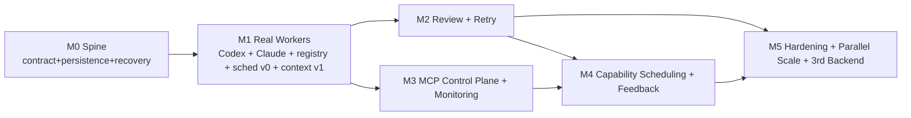

# Loom — Incremental Implementation Plan

**Audience:** Engineering team
**Companion:** [`ARCHITECTURE.md`](./ARCHITECTURE.md) (the design this plan implements). Terminology is canonical there (§5); this document uses those terms unchanged.

> This is a build order, not a design. Every milestone below traces to a section of the architecture. If a milestone would require inventing a concept not in the architecture, stop and update the architecture first — a merged milestone that contradicts the spec is a defect in the spec.

## How this roadmap is shaped

Three principles drive the ordering, and they override the "obvious" progression (basic scheduler → registry → backend → …) that the mission sketched as an *example*:

1. **De-risk the load-bearing wall first.** The backend contract (arch §9) and durable recovery (§15) are where the whole design lives or dies. They ship in **M0**, exercised by a fake backend at zero AI cost, before a dollar is spent on a real provider. Building a scheduler before the contract is proven would be building on sand.
2. **Real value at M1, not at the end.** The first milestone after the spine does real delegated engineering work with real, capability-selected workers. We do not spend five milestones on plumbing before the platform earns its keep.
3. **Prove provider-neutrality by construction.** The two co-first-class backends — Codex CLI and Claude subagents — ship **in the same milestone (M1)** *because they are dissimilar*. Adding the second backend with zero changes above the adapter boundary is not a nice-to-have; it is the **acceptance test for the contract itself**. (Arch §9, §31 improvement (b).)

---

## Milestone 0 — The Spine

**Objective.** Prove the two riskiest abstractions — the backend contract and durable crash-recovery — end to end, with no real AI backend, so everything above them is built on validated ground.

**Scope.**
- Backend Contract interface + all normalized types (`RunSpec`, `RunHandle`, `RunStatus`, `RunResult`, `ReviewSpec/Result`, `BackendCapabilities`) — arch §9.
- **Fake in-memory backend** implementing the contract deterministically (scriptable success/failure/partial/slow outcomes).
- Task and Run entities; the Task state machine core transitions (arch §8) and Run sub-lifecycle.
- Event-sourced persistence on SQLite: append-only `task_event` written **write-ahead**, plus projections (arch §15).
- Minimal Dispatcher + a trivial single-worker "scheduler" (picks the only worker) — just enough to move a task through the lifecycle.
- Restart reconciliation: replay events, `poll` persisted handles, resume/re-queue.
- **Backend conformance test suite** (the contract's executable definition) + a chaos test that kills the process between the write-ahead event and the side effect.

**Deliverables.** A runnable daemon that: accepts a dispatch, runs it on the fake backend, persists every transition, returns a result via `GetResult`, and after `kill -9` mid-run rebuilds correct state on restart.

**Dependencies.** None.

**Acceptance criteria.**
- Conformance suite green against the fake backend.
- Dispatch → Running → Review → Completed round-trip persists correctly and is queryable after restart.
- Kill-between-event-and-effect test: recovery reconstructs the exact expected state (no lost or double-applied transitions).
- No provider SDK is imported anywhere above the adapter package (enforced by a dependency-direction lint).

**Risks.** Reconciliation logic is the subtlest code in the project; under-testing it here poisons everything. *Mitigation:* it is the milestone's headline acceptance test, not a follow-up.

**Estimated complexity.** High. This is the hard core; spend the effort here.

---

## Milestone 1 — Real Workers (two co-first-class backends)

**Objective.** Do real delegated engineering work with real workers chosen by capability — and, in doing so, validate the contract against two dissimilar backends.

**Scope.**
- **Worker Registry** — declarative YAML (arch §11), loaded and hot-reloadable; capability profiles consumed by the scheduler.
- **Claude-subagent adapter** — *lands first within the milestone* (zero external dependency, no separate auth): dispatch = spawn subagent with the Context Package; poll/result/cancel/resume mapped to the subagent lifecycle; native `worktree` isolation; structured output via forced tool. Independently usable at this point.
- **Codex adapter** — `codex exec`/app-server: dispatch (`-m` model + effort explicit, `-s workspace-write -a never`, `-C <worktree>`, `--output-schema`/`-o`), native-id capture from the `--json` stream for cancel/resume, `turn/interrupt` graceful cancel + process-kill fallback, resume via session, structured result capture, `codex review` wired but exercised in M2. All Codex-specific behavior (broker single-flight, heuristic completion, no native timeout) absorbed inside the adapter (arch §9.1).
- **Isolation manager** — create/teardown git worktrees + branches per run (arch §21).
- **Timeout enforcement** — wall-clock budget with forced termination (the platform's job, not the backend's).
- **Context Builder v1** — task-declared inputs (spec/ADR/acceptance criteria) + explicit file selection + code-graph symbol/dependency retrieval; enforces the target worker's context-window budget (arch §14).
- **Scheduler v0** — hard-constraint filtering (availability, tool/repo access, context fit, concurrency, independent-review) + a simple capability score. (Smart scoring is M4.)
- **Break-glass CLI** — dispatch, query queue/registry, get result, cancel; the human/testing surface until MCP (M3).

**Deliverables.** `DispatchWorker(real task)` → scheduler picks a Claude or Codex worker by capability → runs in an isolated worktree → result + branch captured → retrievable via `GetResult`.

**Dependencies.** M0.

**Acceptance criteria.**
- The **same** task definition runs on both backends through the identical contract, with **zero changes** to scheduler/dispatcher/queue when the second backend is added — verified by diff. *(This is the contract's acceptance test.)*
- Conformance suite passes for both real adapters (not just the fake).
- A real small task produces a reviewable branch on each backend.
- Timeout fires and cleanly terminates a deliberately-hung run on both backends.
- Claude-subagent path is demonstrably usable before the Codex path is complete (proves the zero-dependency baseline).

**Risks.** Codex version drift; context-window budgeting errors truncating important context. *Mitigation:* pin/version-check Codex in the adapter; measure and log context-package size vs. budget.

**Estimated complexity.** High.

---

## Milestone 2 — Review Pipeline & Recovery Policy

**Objective.** Make output trustworthy and the system resilient: independent review, bounded revision, and retry-on-failure with worker switching.

**Scope.**
- **Review pipeline** (arch §17): independent-reviewer hard constraint (reviewer ≠ implementer); two review paths behind one interface — Codex native `review` and a dispatched review *task* to any review-capable worker (used for Claude, which has no native review); structured verdicts (accept/revise/reject) + findings.
- **Reviewer-selection policy (decided):** reviews route by capability, not by cost-minimization. The reviewer is chosen among workers with high `review`/`reasoning` strength (and, by convention, `review` in `preferredTaskTypes`) — so an expensive high-reasoning tier (e.g. `gpt-5.6-sol`) is the *right* pick for reviews even though it is the wrong pick for routine implementation. Cost is a tie-break among qualified reviewers, never a reason to send a review to a weak-but-cheap worker. This is the mirror image of the M4 rule that keeps expensive tiers off trivial coding tasks: route by required capability first, let cost break ties. (The full graded `capability_match − cost·sensitivity` scoring is M4; M2 encodes this specifically for reviewer selection.)
- **Revision loop**: `revise` re-queues with review findings prepended to the next run's context; bounded revision count → escalation on exhaustion.
- **Retry policy** (arch §20): per-task-type max attempts, backoff, switch-worker-on-retry (default on after first failure); failure taxonomy handling (timeout / crash / partial-output / invalid-schema / network).
- **Escalation** as a first-class state with reason + resolution.

**Deliverables.** implement → review → (revise loop) → complete, with failed runs retried on alternate workers and escalation when recovery is exhausted.

**Dependencies.** M1.

**Acceptance criteria.**
- A task that fails review loops with feedback and either completes or escalates within the bound.
- Reviewer is never the implementer when `requires_independent_review` is set (property-tested).
- An injected backend crash recovers via retry on an alternate worker; an injected invalid-schema result is treated as a failed run, not a success.
- Revision-rate metric is recorded per task (the context/scheduling quality proxy).

**Risks.** Infinite or expensive revision loops. *Mitigation:* hard revision bound + cost ceiling + escalation, all tested.

**Estimated complexity.** Medium-High.

---

## Milestone 3 — MCP Control Plane & Monitoring

**Objective.** Make the platform **agent-operable** and observable — the milestone that makes Deliverable 3 (the operator skill) real.

**Scope.**
- **MCP server** (arch §18) exposing the Dispatch API verbs (arch §10) as tools: `DispatchWorker`, `ReviewTask`, `ResumeTask`, `CancelTask`, `QueryQueue`, `QueryRegistry`, `InspectWorker`, `GetResult`. Thin transport over the daemon; no logic of its own.
- **Monitoring/Reporting** (arch §19): metrics written as the platform runs; live operational snapshot; epic burn-down (tasks by state over time); per-worker scorecard (feeds M4). Backend `healthcheck()` drives availability transitions.
- **Daemon lifecycle**: start → reconcile → serve MCP + CLI → graceful drain/checkpoint on stop.

**Deliverables.** the Principal Engineer operates the entire platform through MCP tools; a single `status` view answers "what is the platform doing right now."

**Dependencies.** M1 (verbs exist); pairs with M2. Independent of M4 — deliberately sequenced *before* smart scheduling so agent-operability lands sooner (scheduler v0 is good enough to operate).

**Acceptance criteria.**
- The operator skill (Deliverable 3) drives a small epic end-to-end through MCP alone, touching no CLI and no backend command.
- `QueryQueue` + `QueryRegistry` + `GetResult` are sufficient for a fresh operator (lost context) to reconstruct full platform state.
- Live monitoring surfaces queue depth, utilization, cost, and success/failure/retry rates.

**Risks.** MCP surface leaking backend nouns upward. *Mitigation:* the verbs are the arch §10 set verbatim; a review checks no provider term appears in the tool schema.

**Estimated complexity.** Medium.

---

## Milestone 4 — Capability Scheduling & Feedback Loop

**Objective.** Turn selection from "adequate" (v0) into "improves with evidence."

**Scope.**
- Full scoring model (arch §12): weighted capability match + repo familiarity + historical success − cost − latency − load, under the M1 hard constraints; **weights as tunable policy data**.
- Outcome recording per run (worker, task type, accepted-first-try, revisions, duration, cost) → `historical_success`.
- Anti-starvation/fairness (priority + age promotion); global + per-worker concurrency and **cost ceilings** enforced by the scheduler.
- Availability-driven routing: rate-limited/degraded backends auto-route-around via health-driven registry state.

**Deliverables.** A scheduler that ranks workers by the full model and measurably improves selection as outcomes accumulate.

**Dependencies.** M2 (outcome/verdict data), M3 (scorecard surfacing).

**Acceptance criteria.**
- Property tests: hard constraints never violated; no starvation; concurrency + cost caps respected; preference honored when feasible.
- A seeded outcome history shifts worker selection in the expected direction (feedback loop demonstrably closed).
- Cost ceiling halts dispatch at the cap rather than overspending.

**Risks.** Mis-tuned weights degrading selection; cold-start on empty history. *Mitigation:* weights are data (re-tunable without deploy); fall back to hand-set profiles until history accrues.

**Estimated complexity.** Medium.

---

## Milestone 5 — Hardening, Parallel Scale & Third Backend

**Objective.** Production robustness, safe concurrency at scale, and a *demonstrated* proof of extensibility.

**Scope.**
- **Parallel-execution integration** (arch §21): merge-queue-aware sequenced integration; conflict → revision re-base run; decomposition guidance surfaced to the operator via code-graph impact analysis.
- **Security hardening** (arch §22): least-privilege isolation policies per run; credential isolation in adapters; secret scrubbing of context packages; cost-as-boundary enforcement; audit review of the `task_event` log.
- **Third backend** (e.g. OpenAI API, Gemini CLI, or a local model gateway) added to **prove** extensibility = adapter + registry entry only.
- Full chaos suite (daemon kill mid-epic, garbage results, timeout storms, network loss); operational runbook; graceful drain.

**Deliverables.** Multiple concurrent workers producing integrable branches; a third backend added with zero scheduler/skill/API change.

**Dependencies.** M1–M4.

**Acceptance criteria.**
- N concurrent tasks integrate through the merge queue without collision; a deliberate conflict resolves via an automatic re-base revision run.
- **Adding backend #3 touches only a new adapter package + registry entries** — proven by diff (no changes to scheduler, queue, dispatch API, MCP surface, or the operator skill). *This is the prime-directive acceptance test.*
- Security tests pass (secret scrubbing, isolation, cost cap).
- Chaos suite passes with correct final state in every scenario.

**Risks.** Integration-time conflicts under high concurrency; a third backend surfacing a contract gap. *Mitigation:* serialized integration + re-base loop; if the third backend *does* require an above-boundary change, that is the signal the contract was drawn wrong (arch §9.3) — fix the contract, which is cheaper now than later.

**Estimated complexity.** Medium.

---

## Milestone-to-architecture traceability

| Milestone | Primary architecture sections |
|---|---|
| M0 | §9 (contract), §8 (state machine), §15 (persistence), §16, §23 |
| M1 | §9.1, §9.2, §11 (registry), §12 (sched v0), §14 (context), §21 (isolation) |
| M2 | §17 (review), §20 (recovery) |
| M3 | §10 (dispatch API), §18 (MCP/daemon), §19 (monitoring) |
| M4 | §12 (full scheduler), §19 (scorecard) |
| M5 | §21 (parallel), §22 (security), §9.3 (extensibility), §24 (scale) |

## What is intentionally out of the roadmap

These map to architecture §26 (future extension points) and are **not** part of this roadmap. When the project has its own repository and issue tracker, each should be opened as a tracked issue before any work begins on it (per a deferred-work tracking policy):

- Learned/ML scheduling policy (M4 ships a legible heuristic on purpose).
- High-availability / multi-node daemon (arch §30 known weakness; SQLite→Postgres is the enabling adapter swap, §24).
- Non-local-checkout isolation for pure-API backends (arch §30; the `isolationModes` capability admits it, the path is unbuilt).
- Multi-tenancy (explicit non-goal, arch §3).

## First move

Start M0 with the conformance suite and the fake backend **before** any real adapter. The contract is the product; everything else is an implementation of it. If the fake backend is awkward to write against the contract, the contract is wrong — and that is far cheaper to learn now than after Codex and Claude are both wired.
